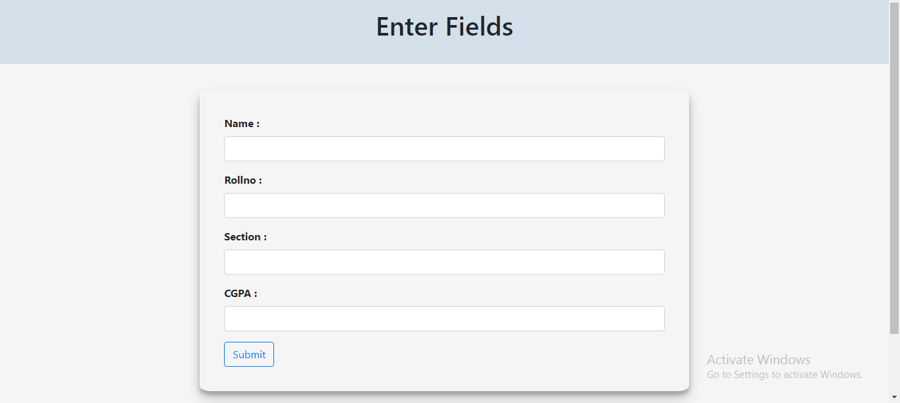
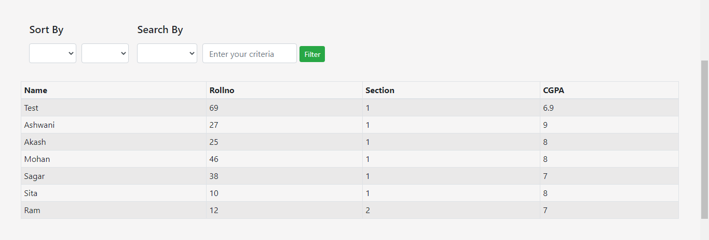
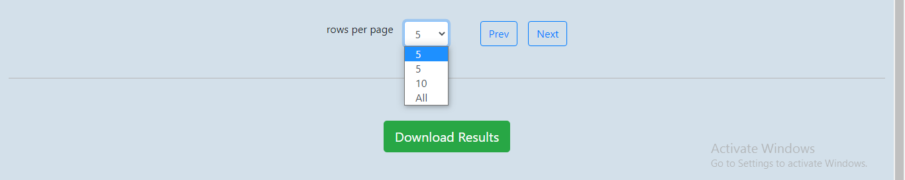

# Report-Format

## Available Scripts

In the project directory, you can run:

### `npm start`

Runs the app in the development mode. 
Open [http://localhost:3000](http://localhost:3000) to view it in the browser.

Runs the app in the production mode. 
follow [https://abhishek-report-format.herokuapp.com/?limit=5&page=1](https://abhishek-report-format.herokuapp.com/?limit=5&page=1) to view it in the browser.

The page will reload if you make edits. 

### Button to create report or document

### Fields to be entered

### Searching Sorting Features

1.Searching 
a. Name, Rollno, Section, CGPA 
b. Asc, Desc 

2.Sorting 
a. Name, Rollno, Section, CGPA 
b. Input Criteria Value 

3.Filter Button

### Pagination And Downloading Features

1.Pagination 
a. 5, 10, All 
b. previous and next buttons for exploring pagination 

2.Download Results Button 
Button to download seen results in excel format 

